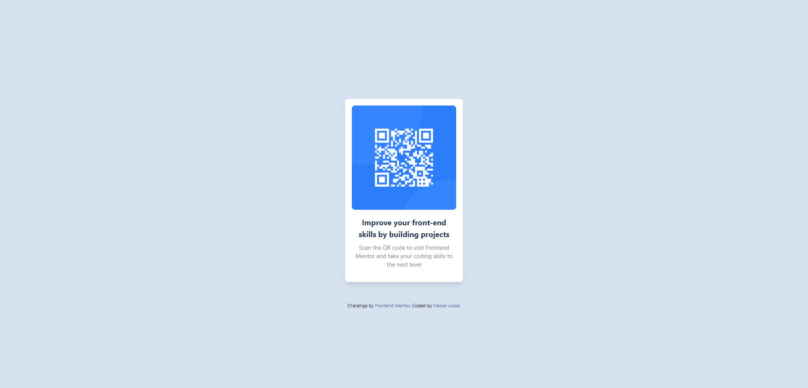

# Frontend Mentor - QR code component solution

This is a solution to the [QR code component challenge on Frontend Mentor](https://www.frontendmentor.io/challenges/qr-code-component-iux_sIO_H). Frontend Mentor challenges help you improve your coding skills by building realistic projects. 

## Table of contents

- [Overview](#overview)
  - [Screenshot](#screenshot)
  - [Links](#links)
- [Author](#author)
- [Acknowledgments](#acknowledgments)

**Note: Delete this note and update the table of contents based on what sections you keep.**

## Overview

### Screenshot

### Links

- Solution URL: [QR Code Challenge Solution](https://github.com/marcellosso/challenges-frontendmentor/tree/main/qr-code)
- Live Site URL: [Live - QR Code](https://marcellosso.github.io/challenges-frontendmentor/qr-code/)

## Author

- Frontend Mentor - [@marcellosso](https://www.frontendmentor.io/profile/marcellosso)